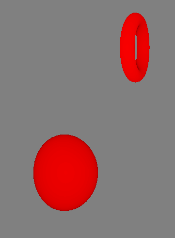
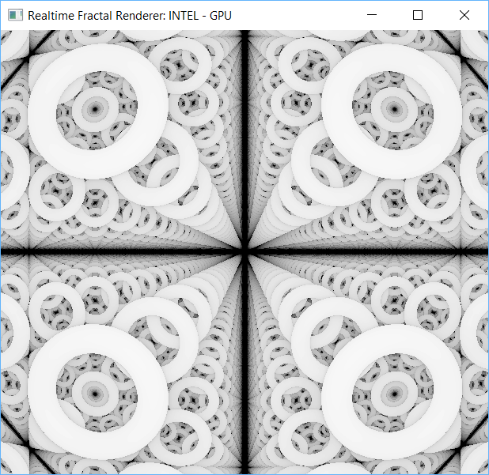
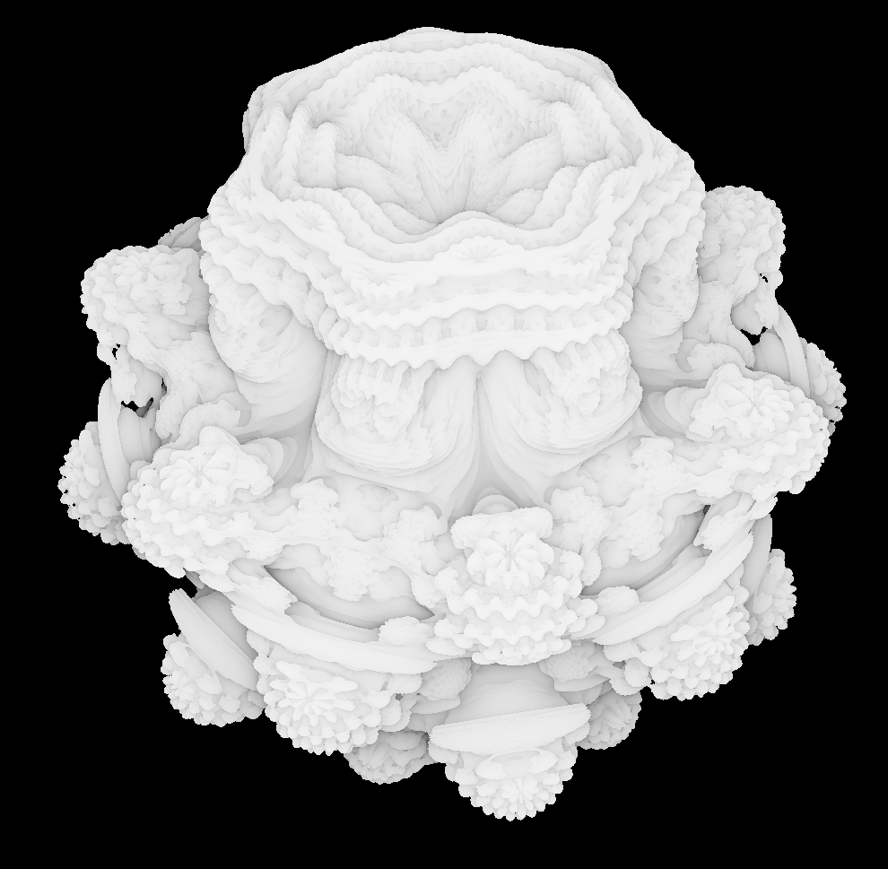
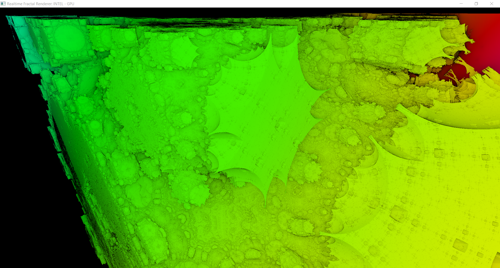

# fractals
A project for AP CS, where we render 3D fractals using distance estimators and ray marching.

## Week 1 Update (4/11)
<ul>
  <li>GUI/rendering somewhat working</li>
  <li>Some GUI features including: changing the color of a single pixel, creating a colored rectangle on the screen</li>
  <li>Keyboard and mouse controls implemented, but need to be connected to the computing classes</li>
  <li>Vector3D, UnitVector3D, and Camera classes done</li>
  <li>Vector classes have a variety of common vector math methods</li>
  <li>Camera class has methods to translate keyboard and mouse input to movement relative to direction vector</li>
</ul>

## Week 2 Update (4/18)
<ul>
  <li>Mouse and Keyboard input implemented, but still have issues</li>
  <li>Basic kernel written to render a sphere using raymarching (still has bugs)</li>
  <li>Compute and GUI handlers consolidated into one file</li>
  <li>Full kernel integration: frames are now rendered using openCL and displayed properly, and input is translated into position/direction changes in the camera class, which is then sent back to the kernel for the next frame</li>
</ul>

## Week 3 Update (4/26)
<ul>
  <li>Some OpenGL implementation drawing simple 2d shapes, but still has bugs and doesn't work</li>
  <li>The kernel now properly shades the rendered images based on the number of iterations required per pixel. Here is a sample image of a torus and a sphere:
    
  </li>
  <li>Mouse input issue fixed - the screen no longer shakes incessantly</li>
</ul>

## Week 4 Update (5/4)
<ul>
  <li>Not much work was done this week because of preparation for AP tests</li>
  <li>Folding space was tested and worked successfully. Here is a sample image of a world filled with infinite toruses:
    
  </li>
  <li>Minor optimisations such as the vertex and fragment shader sources being moved to separate files</li>
  <li>Window can be resized, and automatically recompiles the kernel with the new resolution (only works on windows for some reason)</li>
  <li>The mouse can be released by pressing ESC and recaptured by clicking anywhere in the window</li>
  <li>Lots of distortion is present along the Z axis (when rendering objects above and below the camera) but none along the X and Y axes for some reason</li>
</ul>

## Week 5 Update (5/10)
<ul>
  <li>All distortion eliminated</li>
  <li>First Fractals! Here is a Mandelbulb rendering that we are quite proud of:
    
  </li>
  <li>Work is being done on coloring fractals, making them more detailed and some preliminary GUI stuff</li>
</ul>

## Week 6 Update (5/18)
<ul>
  <li>Added a time variable that increments frame by frame, allowing fractals to be animated: 
   
  </li>
  <li>Added mandelbox fractal:
  
  </li>
  <li>Fractals are colored based on distance from the origin, more sophisticated coloring that emphasizes the structure of the fractal to be added later. </li>
  <li>More control over the renderer: +/- adjusts the number of iterations for the fractal and shift +/- adjusts the number of iterations per ray. p also plays/pauses the animation.</li>
</ul>

## Week 7 Update (5/24)
<ul>
  <li>Added antialiasing</li>
  <li>Added 3d Koch Snowflake Fractal</li>
  <li>Added the ability to export a frame</li>
  <li>Ctrl +/- to increase/decrease movement speed</li>
</ul>

## Week 8 Update (5/31)
<ul>
  <li>Added arbitrarily high resolution image export</li>
</ul>
